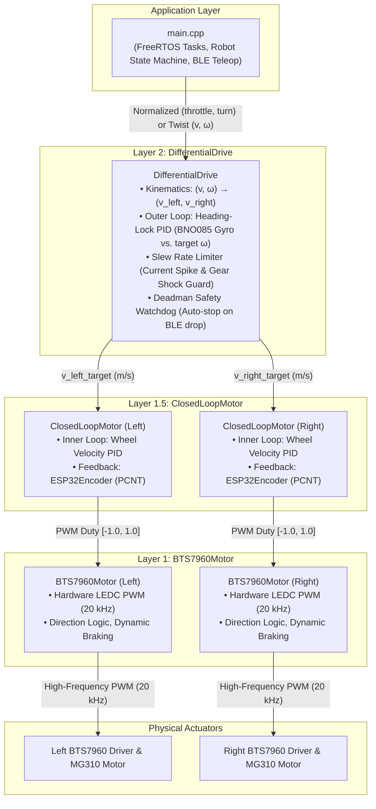
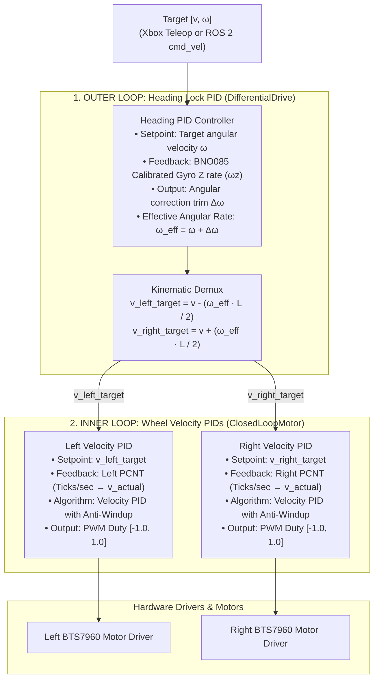

# Orca Robot — Motor Control & Drivetrain Architecture

This document formalizes the software architecture, design decisions, interface specifications, and closed-loop control topology for the motor drive and locomotion subsystem of the **Orca** mobile robot.

## 1. Architectural Decision: Layered Drivetrain Architecture

### 1.1 Decision Summary

We adopt a **Layered Architecture** that decouples physical hardware PWM generation from vehicle kinematics, teleoperation mixing, and closed-loop feedback.



### 1.2 Rationale & Trade-Offs

- **Separation of Concerns:**
  - `BTS7960Motor` has zero knowledge of robot geometry or encoders. It only manages PWM duty, direction pins, and hardware timers for a single actuator.
  - `ClosedLoopMotor` manages a single wheel's speed regulation, matching ticks to physical meters per second.
  - `DifferentialDrive` manages multi-wheel coordination, heading tracking, and chassis safety.
- **ROS 2 `cmd_vel` Readiness (Phase 2):** `DifferentialDrive` exposes `setTwist(float linearX, float angularZ)` matching `geometry_msgs/msg/Twist`, making the transition to Micro-ROS on the Raspberry Pi transparent.
- **Incremental Testing:** We can bring up and verify Phase 1A (open-loop teleoperation) using `BTS7960Motor` directly, then seamlessly introduce `ClosedLoopMotor` in Phase 1C without modifying higher-level logic.

## 2. Hardware Interface & Electrical Guidelines

### 2.1 BTS7960 (IBT-2) Driver Pinout & Control Truth Table

Each MG310 motor is driven by a dedicated BTS7960 module.

| BTS7960 Pin         | Function           | ESP32 Connection              | Description                                          |
| :------------------ | :----------------- | :---------------------------- | :--------------------------------------------------- |
| **`RPWM`**          | Forward PWM        | Dedicated GPIO (LEDC)         | High-frequency PWM for forward rotation              |
| **`LPWM`**          | Reverse PWM        | Dedicated GPIO (LEDC)         | High-frequency PWM for reverse rotation              |
| **`R_EN` / `L_EN`** | Bridge Enables     | Tied together to GPIO or 3.3V | HIGH = Driver Active, LOW = Driver Freewheel (Coast) |
| **`VCC`**           | Logic Supply       | 5V DC (XL4015 Buck)           | Powers internal optocouplers / logic                 |
| **`GND`**           | Ground Reference   | Common System GND             | Shared reference with ESP32                          |
| **`B+` / `B-`**     | High-Current Power | 12V Battery Bus               | Fused power directly from 3S2P pack                  |
| **`M+` / `M-`**     | Motor Terminals    | MG310 Motor Leads             | High-current output to DC motor                      |

#### Control Logic Matrix

- **Forward Drive:** `RPWM = PWM (Duty)`, `LPWM = LOW`, `EN = HIGH`
- **Reverse Drive:** `RPWM = LOW`, `LPWM = PWM (Duty)`, `EN = HIGH`
- **Active Dynamic Brake:** `RPWM = LOW`, `LPWM = LOW`, `EN = HIGH` (shorts motor terminals to GND via low-side MOSFETs, arresting motor shaft)
- **Freewheel / Coast:** `EN = LOW` (high impedance, zero resistance)

### 2.2 Ultrasonic PWM Generation (20 kHz)

- Standard Arduino PWM operates at 490 Hz / 980 Hz, causing loud, high-pitched coil whine from motor windings.
- The ESP32 hardware LEDC peripheral will be configured to **20,000 Hz (20 kHz)**, pushing the switching frequency above human hearing.
- At 20 kHz with an 80 MHz APB clock, the ESP32 LEDC timer supports up to **11-bit resolution** ($2^{11} = 2048$ steps). We use **10-bit resolution (0–1023)** for low computation overhead and fine speed resolution.

### 2.3 Slew-Rate Limiting (Protection Against Current Surges)

- MG310 DC motors draw 0.4A–0.8A while running, but abrupt direction changes from $+1.0$ to $-1.0$ produce current spikes between **2.5A and 3.5A per motor**.
- A combined 7A surge risks blowing the in-line 5A/7.5A system fuse or triggering the 18650 pack's internal BMS overcurrent cutoff.
- The `DifferentialDrive` layer enforces a software **slew-rate limiter** (maximum acceleration $\Delta \text{speed} / \Delta t$) to ramp duty cycles smoothly and protect mechanical gears from sudden torque shock.

### 2.4 Safety Watchdog (Deadman Switch)

- If the Xbox Bluetooth controller disconnects or communication stalls while the robot is driving, Orca must not continue moving indefinitely.
- `DifferentialDrive` requires an active heartbeat. If no drive command is received within **250 ms**, the controller enters a failsafe state and commands an immediate stop/brake.

## 3. Recommended ESP32 GPIO Allocation

To prevent hardware bus conflicts on the ESP32 DevKit:

- **Avoid Strapping Pins:** Do not use GPIO 0, 2, 12, or 15 for motor PWM or encoders (can disrupt ESP32 flashing or boot mode).
- **Avoid ADC2 for Sensors:** GPIOs on ADC2 cannot be read while BLE / Wi-Fi is active. The battery voltage divider must use ADC1 (e.g., GPIO 34, 35, 36, or 39).
- **Reserve I2C:** GPIO 21 (SDA) and GPIO 22 (SCL) are reserved for the BNO085 IMU.

| Peripheral        | Subsystem         | Pin                 | Notes                             |
| :---------------- | :---------------- | :------------------ | :-------------------------------- |
| **Left Motor**    | BTS7960 `RPWM`    | GPIO 18             | Hardware LEDC PWM Channel         |
| **Left Motor**    | BTS7960 `LPWM`    | GPIO 19             | Hardware LEDC PWM Channel         |
| **Left Motor**    | BTS7960 `EN`      | GPIO 5 / Tied 3.3V  | Optional enable control           |
| **Right Motor**   | BTS7960 `RPWM`    | GPIO 25             | Hardware LEDC PWM Channel         |
| **Right Motor**   | BTS7960 `LPWM`    | GPIO 26             | Hardware LEDC PWM Channel         |
| **Right Motor**   | BTS7960 `EN`      | GPIO 23 / Tied 3.3V | Optional enable control           |
| **Left Encoder**  | Phase A / Phase B | GPIO 16, GPIO 17    | ESP32 PCNT hardware pulse counter |
| **Right Encoder** | Phase A / Phase B | GPIO 32, GPIO 33    | ESP32 PCNT hardware pulse counter |
| **BNO085 IMU**    | SDA / SCL         | GPIO 21, GPIO 22    | Hardware I2C (400 kHz)            |
| **Battery ADC**   | Voltage Divider   | GPIO 34 (ADC1)      | ADC1 compatible with BLE (Optional / Phase 1B) |

## 4. Closed-Loop Control & Sensor Integration Architecture

Closed-loop control is organized as a **cascaded (two-layer) control loop** running deterministically on ESP32 Core 0.



### 4.1 Inner Loop: Wheel Velocity PID (`ClosedLoopMotor`)

- **Location:** `orca-controller/lib/ClosedLoopMotor`
- **Why here?** Wheel speed regulation is strictly decoupled per wheel. The left motor and encoder do not need to know about track gauge or the right wheel.
- **Feedback Mechanism:** Uses `ESP32Encoder` connected to the ESP32 **Pulse Counter (PCNT)** hardware peripheral. The count delta $\Delta \text{ticks}$ divided by time step $\Delta t$ yields actual wheel speed in meters per second:
  $$\text{Ticks Per Meter} = \frac{\text{PPR} \times \text{Gearbox Ratio}}{\pi \times \text{Wheel Diameter}}$$
  $$v_{\text{actual}} = \frac{\Delta \text{ticks}}{\Delta t \times \text{Ticks Per Meter}}$$
- **Controller Algorithm:** Standard discrete PID with Feedforward ($K_{ff}$) and Integral Anti-Windup Clamping:
  $$u(t) = K_{ff} v_{\text{target}} + K_p e(t) + K_i \int e(t) dt + K_d \frac{de(t)}{dt}$$
  _(Feedforward $K_{ff}$ supplies the baseline voltage needed for a given speed, while PID corrects for carpet drag, wheel slip, and battery voltage sag).\_

### 4.2 Outer Loop: Heading-Lock PID (`DifferentialDrive`)

- **Location:** `orca-controller/lib/DifferentialDrive`
- **Why here?** Heading stabilization is a coupled chassis-wide behavior. If the robot drifts right while driving straight on a carpet threshold, the BNO085 gyro detects $\omega_z < 0$. The outer PID trims the setpoints of **both** wheels simultaneously to restore the heading.
- **Heading-Lock Trigger:** Activated specifically when the pilot or planner requests straight-line motion ($\omega_{\text{target}} \approx 0$). In sharp intentional turns, heading-lock relaxes or follows the commanded $\omega$.

### 4.3 Deterministic FreeRTOS Execution (Core 0 vs. Core 1)

To ensure the PID controllers operate without timing jitter:

- **ESP32 Core 1 (Communication Core):** Dedicated to the BLE stack (`XboxController`), Wi-Fi, and background serial logging.
- **ESP32 Core 0 (Real-Time Control Core):** Runs a high-priority FreeRTOS task at a fixed rate of **50 Hz to 100 Hz** ($T_s = 10\text{ ms}$ or $20\text{ ms}$):

  ```cpp
  void controlLoopTask(void* pvParameters) {
    TickType_t xLastWakeTime = xTaskGetTickCount();
    const TickType_t xFrequency = pdMS_TO_TICKS(10); // 100 Hz deterministic loop

    for (;;) {
      // 1. Read BNO085 gyro Z rate
      // 2. Compute heading trim
      // 3. Update inner wheel velocity PIDs
      // 4. Output PWM to BTS7960 drivers
      drivetrain.update();

      vTaskDelayUntil(&xLastWakeTime, xFrequency);
    }
  }
  ```

## 5. Software Interface Specifications

### 5.1 Layer 1: `BTS7960Motor` (Actuator Interface)

Located in `orca-controller/lib/BTS7960Motor`:

```cpp
#ifndef __BTS7960_MOTOR_H__
#define __BTS7960_MOTOR_H__

#include <Arduino.h>

struct BTS7960Config {
  uint8_t pinRPWM;        // Forward PWM pin
  uint8_t pinLPWM;        // Reverse PWM pin
  int8_t  pinEN;          // Enable pin (-1 if tied permanently to HIGH)
  bool    inverted;       // Invert direction flag (for mirrored chassis mounting)
  uint32_t pwmFreq;       // PWM frequency in Hz (Default: 20000 Hz)
  uint8_t  pwmResolution; // Resolution in bits (Default: 10 bits -> 0..1023)
};

class BTS7960Motor {
 public:
  explicit BTS7960Motor(const BTS7960Config& config);

  void begin();

  // Set motor duty cycle in normalized range [-1.0f, +1.0f]
  //  +1.0f = Full Forward, 0.0f = Active Stop (Brake), -1.0f = Full Reverse
  void setSpeed(float speed);

  // Active electronic brake (shorts motor terminals to GND via low-side FETs)
  void brake();

  // Freewheel / high-impedance coast (disables H-bridge)
  void coast();

  float getSpeed() const;
  bool isEnabled() const;

 private:
  BTS7960Config _config;
  float _currentSpeed;
  bool _enabled;
  uint32_t _maxDuty;

  void applyOutput(float speed);
};

#endif // __BTS7960_MOTOR_H__
```

### 5.2 Layer 1.5: `ClosedLoopMotor` (Wheel Velocity Controller Interface)

Located in `orca-controller/lib/ClosedLoopMotor`:

```cpp
#ifndef __CLOSED_LOOP_MOTOR_H__
#define __CLOSED_LOOP_MOTOR_H__

#include <Arduino.h>
#include <ESP32Encoder.h>
#include "BTS7960Motor.h"

struct WheelPIDConfig {
  float kp;
  float ki;
  float kd;
  float kff;                  // Feedforward gain
  float maxOutput;            // Clamping output (typically 1.0f for normalized PWM)
  float ticksPerMeter;        // (PPR * GearRatio) / (PI * WheelDiameter)
};

class ClosedLoopMotor {
 public:
  ClosedLoopMotor(BTS7960Motor& motor,
                  ESP32Encoder& encoder,
                  const WheelPIDConfig& pidConfig);

  void begin();

  // Target linear velocity in meters per second
  void setTargetVelocity(float targetMetersPerSec);

  // Periodic update called deterministically at 50-100 Hz
  void update(float dt);

  // State & Telemetry getters
  float getTargetVelocity() const;
  float getActualVelocity() const;
  int64_t getEncoderTicks() const;
  void resetEncoder();

  // Direct bypass to low-level actuator (for open-loop bench testing)
  void setOpenLoopDuty(float duty);
  void brake();

 private:
  BTS7960Motor& _motor;
  ESP32Encoder& _encoder;
  WheelPIDConfig _config;

  int64_t _lastTicks;
  float _targetVelocity;
  float _actualVelocity;
  float _integral;
  float _lastError;
  bool _openLoopMode;
};

#endif // __CLOSED_LOOP_MOTOR_H__
```

### 5.3 Layer 2: `DifferentialDrive` (Kinematic & Heading Interface)

Located in `orca-controller/lib/DifferentialDrive`:

```cpp
#ifndef __DIFFERENTIAL_DRIVE_H__
#define __DIFFERENTIAL_DRIVE_H__

#include <Arduino.h>
#include "ClosedLoopMotor.h"

struct DrivetrainConfig {
  float trackWidthMeters;     // Axle track gauge L (~0.20m for Orca chassis)
  float maxLinearVelocity;    // Maximum linear velocity in m/s
  float maxAngularVelocity;   // Maximum angular velocity in rad/s
  float maxSlewRate;          // Max acceleration in m/s^2 (prevents current spikes)
  uint32_t watchdogTimeoutMs; // Failsafe timeout (Default: 250 ms)

  // Heading Lock PID parameters
  bool  enableHeadingLock;
  float headingKp;
  float headingKi;
  float headingKd;
};

class DifferentialDrive {
 public:
  DifferentialDrive(ClosedLoopMotor& leftMotor,
                    ClosedLoopMotor& rightMotor,
                    const DrivetrainConfig& config);

  void begin();

  // Runs on Core 0 at 50-100 Hz: updates watchdog, heading-lock trim, and motor PIDs
  void update(float gyroYawRateZ = 0.0f);

  // Teleoperation input from Xbox thumbsticks [-1.0f, +1.0f]
  void driveArcade(float throttle, float turn);

  // Unicycle kinematics input (ROS 2 geometry_msgs/Twist equivalent)
  void setTwist(float linearX, float angularZ);

  // Failsafes
  void emergencyStop();
  void coast();

  // Odometry query (ticks & velocities for Micro-ROS wheel/odom)
  void getWheelStates(float& outLeftVel, float& outRightVel,
                      int64_t& outLeftTicks, int64_t& outRightTicks) const;

 private:
  ClosedLoopMotor& _left;
  ClosedLoopMotor& _right;
  DrivetrainConfig _config;

  unsigned long _lastCommandTime;
  unsigned long _lastUpdateTime;

  float _targetLinear;
  float _targetAngular;
  float _rampedLinear;
  float _rampedAngular;
  float _headingIntegral;
};

#endif // __DIFFERENTIAL_DRIVE_H__
```

## 6. Third-Party Library Integration Plan

| Subsystem               | Selected Library                 | PlatformIO Identifier                          | Integration Role                                                                      |
| :---------------------- | :------------------------------- | :--------------------------------------------- | :------------------------------------------------------------------------------------ |
| **Low-Level Motor PWM** | **Native ESP32 LEDC Driver**     | _(Built into Arduino-ESP32 Core)_              | Guarantees exact 20 kHz ultrasonic frequency and eliminates external dependencies.    |
| **Wheel Encoders**      | **ESP32Encoder** (madhephaestus) | `madhephaestus/ESP32Encoder @ ^0.12.0`         | Uses ESP32 hardware PCNT peripheral for count acquisition without CPU interrupt load. |
| **Velocity PID**        | **QuickPID** or Custom Discrete  | `dlloydev/QuickPID @ ^3.1.9`                   | High-performance 32-bit floating point PID with anti-windup and derivative filtering. |
| **Xbox BLE Receiver**   | **XboxSeriesXControllerESP32**   | `asukiaaa/XboxSeriesXControllerESP32_asukiaaa` | _(Already installed and validated in `lib/XboxController`)_                           |

## 7. Phased Implementation Strategy

1. [x] **Phase 1A: Open-Loop Teleoperation**
   - [x] Implement `BTS7960Motor` with 20 kHz LEDC PWM.
   - [x] Implement open-loop `DifferentialDrive` with arcade mixing, slew-rate ramping, and BLE watchdog.
   - [ ] Verify driving Orca on floor surfaces with the Xbox controller.
2. [ ] **Phase 1B: Encoder Integration & Calibration**
   - Add `ESP32Encoder` to `platformio.ini`.
   - Wire encoder pins to PCNT GPIOs (16/17 and 32/33).
   - Spin wheels 1 meter; verify measured ticks against calculated $\text{Ticks Per Meter}$.
3. [ ] **Phase 1C: Closed-Loop Velocity PID**
   - Implement `ClosedLoopMotor` with discrete velocity PID.
   - Spawn deterministic 100 Hz FreeRTOS task on Core 0.
   - Tune $K_{ff}$, $K_p$, and $K_i$ so wheel speed remains invariant across flat floor and carpet transitions.
4. [ ] **Phase 1D: Heading Lock Fusion**
   - Bring up BNO085 IMU over I2C (400 kHz).
   - Feed calibrated gyro $Z$-rate into `DifferentialDrive::update()`.
   - Verify Orca tracks dead-straight without veering even under intentional wheel resistance.
