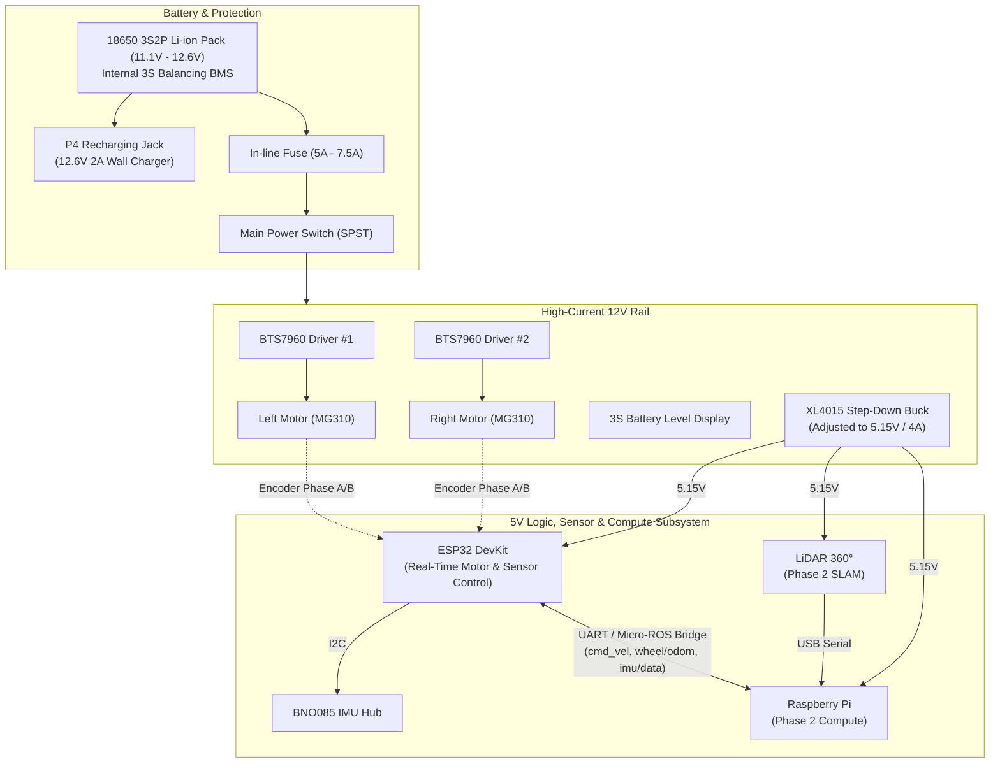

# Orca Robot — Engineering Architecture, Hardware Specification & Project Roadmap

This document serves as the single source of truth and comprehensive engineering brief for the autonomous mobile robot named **Orca** (formerly framed as a generic rover project, continuing the lineage of predecessors *Baleia* and *Piranha*).

---

## 1. Project Overview & Primary Mission

* **Objective:** Design, construct, and program a two-wheel differential drive indoor mobile robot capable of precise line navigation, Xbox Bluetooth remote teleoperation, full-room 360° 2D LiDAR scanning, simultaneous localization and mapping (SLAM), and future autonomous docking/charging.
* **Target Environment:** Indoor residential spaces (flat floors, transitions to low-pile rugs, doorways, narrow hallway navigation).
* **Development Strategy:** Two-phase phased delivery:
* **Phase 1 (Low-Level Control & Teleop):** Assemble physical chassis, wire safe multi-voltage power distribution, implement motor drivers with high-resolution magnetic encoder feedback, run closed-loop PID straight-line correction, and pilot via an Xbox Bluetooth controller on an ESP32.
* **Phase 2 (High-Level Autonomy & Perception):** Mount a single-board computer (Raspberry Pi 4/5) and a 360° planar LiDAR, establish Micro-ROS / serial communication bridge (`cmd_vel` and `odom`), build occupancy grid maps via SLAM, and deploy Nav2 path planning.

---

## 2. Key Architectural Decisions & Trade-Off Analysis

### 2.1 Chassis & Locomotion Kinematics

| Architecture Evaluated | Mechanism | Pros | Cons | Verdict |
| --- | --- | --- | --- | --- |
| **Tracked / Tank** *(e.g., RoboCore Rocket Tank)* | Continuous rubber tracks (skid-steer) | Can cross small thresholds; robust appearance. | Unpredictable track slip destroys wheel odometry; turns tear carpets; heavy current spikes during pivot. | **Rejected** (Unsuitable for LiDAR SLAM without expensive RTK/visual odometry). |
| **Ackermann Steering** | Front steering rack with servo + rear drive axle (car-like) | Realistic automotive kinematics; zero lateral tire scrub. | Non-holonomic; non-zero minimum turning radius (cannot turn in place); struggles in tight indoor spaces. | **Rejected** for indoor room exploration. |
| **4WD Skid-Steer** | 4 fixed rubber wheels driven independently | Simple rigid chassis; symmetric load distribution. | Lateral wheel scrub on turns creates massive cumulative wheel encoder drift. | **Rejected**. |
| **3WD Differential Drive** *(2 Driven Wheels + 1 Caster)* | 2 independent drive wheels on a common axis + 1 passive caster wheel | Zero turning radius (spins in place); native ROS 2 `diff_drive_controller` support; clean, low-slip odometry. | Slight pitch rocking if caster transitions over floor thresholds. | **Selected (Chosen Architecture)**. |

### 2.2 Scale & Structural Material

* **Didactic Acrylic Kits (2WD Hobby):** Rejected. The classic 20 cm clear acrylic chassis with yellow plastic-gear DC motors (TT motors) and slotted optical disks cannot support the weight of industrial batteries, step-down converters, a Raspberry Pi, and a LiDAR. Yellow DC motors lack torque and have severe gear backlash. The optical disks produce only 20 pulses per revolution (PPR), which is completely inadequate for fine SLAM odometry.
* **Heavy-Duty Aluminum 3WD Kit:** Selected. An aluminum alloy chassis plate (~25–30 cm platform footprint) provides mechanical rigidity, a low center of mass, pre-drilled M2.5/M3 mounting slots for electronics/sensor towers, and accommodates heavy-duty all-metal geared DC motors (MG310 standard).

### 2.3 Power Subsystem Architecture: LiPo vs. 18650 Pack

| Metric | LiPo 3S 11.1V (Pouch Cell) | 18650 3S2P Li-ion Pack (Cylindrical with internal BMS) |
| --- | --- | --- |
| **Nominal Voltage** | 11.1V (12.6V fully charged, 3S) | 11.1V (12.6V fully charged, 3S2P) |
| **Capacity & Weight** | ~2200 mAh (~200 g) | ~4400 mAh to 5000 mAh (~300 g) |
| **Active Autonomy** | ~1h15 to 1h35 continuous | ~2h30 to 3h30 continuous |
| **Internal Safety Circuit** | **None** (raw cells; relies solely on user discipline and external cutoffs) | **Integrated 3S BMS** (auto-cutoff for over-discharge, over-charge, and short-circuits) |
| **Charging Procedure** | High maintenance: requires taking battery off robot, plugging both high-current leads and JST-XH balance leads into bench charger (e.g., iMAX B6). | Simplified: plug a single 12.6V DC P4 barrel jack directly into the chassis; internal BMS handles cell balancing. |
| **Auto-Docking Feasibility** | **Near impossible** safely (cannot auto-align 6 balance pins reliably). | **High**: Robot only needs to touch two spring-loaded contacts (+ / -) carrying 12.6V CC/CV. |
| **Verdict** | Viable for Phase 1 prototypes, but manual. | **Selected as the strategic choice for Orca.** |

* **Rejection of Giant 3S6P (15,000 mAh) Packs:** An 18-cell pack weighs ~1 kg and measures over $11 \times 7 \times 7\text{ cm}$. This excessive payload crushes caster springs, overloads MG310 gearboxes, increases rotational inertia, and consumes all chassis volume. The 3S2P configuration (~300 g, ~4400–5000 mAh) is the optimal sweet spot.

### 2.4 Motor Driver Selection

* **TB6612FNG / L298N:** Rejected. The MG310 motors draw 0.4A–0.8A running, but exhibit stall and hard-reversal current spikes between 2.5A and 3.5A. The TB6612FNG (1.2A continuous / 3.2A peak) would trigger over-current thermal shutdown or fail permanently. The L298N drops 1.8V–2.0V as internal heat due to obsolete bipolar junction transistors (BJT).
* **Dual BTS7960 (IBT-2) Drivers:** Selected. Each BTS7960 board is an integrated high-current H-bridge capable of handling up to 43A peak with low $R_{DS(on)}$ MOSFETs. Using one dedicated board per MG310 motor ensures zero thermal strain, no voltage drop, complete electrical isolation, and total immunity to inductive voltage spikes during rapid motor reversals.

### 2.5 Low-Level Processing: ESP32 vs. Arduino Uno vs. Direct Raspberry Pi

* **Arduino Uno:** Rejected (insufficient hardware interrupt pins for two dual-channel quadrature encoders; 8-bit architecture; lacks integrated wireless).
* **Direct Raspberry Pi GPIO Motor Driving:** Rejected. Non-real-time Linux operating system schedulers cannot reliably handle 20 kHz PWM generation and sub-millisecond encoder interrupt processing while simultaneously running SLAM point-cloud transformations without stuttering or missing counts.
* **ESP32 DevKit (Selected):** 240 MHz dual-core Tensilica Xtensa 32-bit MCU. Hardware pulse counter (PCNT) peripheral counts encoder pulses without CPU overhead; core 0 runs real-time PID loops and motor PWM, while core 1 handles Bluetooth communication with the Xbox controller. Seamless upgrade path to Micro-ROS over UART in Phase 2.

### 2.6 Inertial Sensing & Orientation Estimation (GPS vs. Compass vs. IMU)

| Technology / Sensor | Mechanism / Features | Pros | Cons | Verdict |
| --- | --- | --- | --- | --- |
| **GPS / GNSS** | Satellite trilateration | Absolute global coordinates outdoors. | RF signals fail to penetrate residential roofs/walls; multipath reflection errors cause 3–5 m jumps indoors. | **Rejected** (Unusable for indoor navigation). |
| **Magnetometer (Electronic Compass)** | Earth magnetic field vector sensing | Provides absolute heading referenced to magnetic North. | Extreme indoor hard/soft iron distortions (concrete rebar, metal framing, household appliances) plus heavy magnetic interference from MG310 motor stators and BTS7960 high-current rails cause erratic yaw drift. | **Rejected / Disabled** (Indoor heading must rely on inertial gyro fusion). |
| **MPU-6050** | Legacy 6-DOF (3-axis Accel + 3-axis Gyro) | Extremely cheap (~$2); ubiquitous libraries. | Obsolete (discontinued by TDK/InvenSense; market dominated by counterfeits); raw outputs drift rapidly with temperature; requires manual zero-offset tare at boot; requires heavy software filtering (Madgwick/Mahony) on MCU. | **Rejected**. |
| **BNO085 (CEVA / Bosch Sensortec)** | 9-DOF Sensor Hub with onboard 32-bit ARM Cortex-M0+ running Hillcrest SH-2 firmware | Hardware-level Kalman filtering; direct output of unitless orientation quaternions ($x, y, z, w$); native **Game Rotation Vector (6-DOF mode)** completely bypassing magnetic anomalies; dynamic background auto-calibration; zero math overhead on MCU. | Higher component cost (~$15–$20); uses SHTP packet protocol over I2C. | **Selected (Chosen Architecture)**. |

* **Host Interfacing Decision (ESP32 vs. Raspberry Pi):** The BNO085 is wired directly to the **ESP32** over I2C (400 kHz) rather than the Raspberry Pi. This guarantees deterministic, low-latency, real-time sensor sampling under FreeRTOS, allows the ESP32 to run heading-stabilized closed-loop PID in Phase 1 without the Pi present, and cleanly streams packaged `/imu/data` over Micro-ROS in Phase 2 without non-real-time Linux scheduling jitter.

---

## 3. Orca Detailed Hardware Specification

### 3.1 Mechanical & Structural Components

* **Base Platform:** 3WD Aluminum Robot Chassis Kit (Differential drive with heavy-duty metal baseplate).
* **Drive Wheels:** 2x high-traction rubber wheels (approx. 65 mm diameter) driven through brass hex couplers.
* **Support Wheel:** 1x omnidirectional steel/nylon caster ball bearing assembly mounted along the longitudinal centerline.
* **Sensor Deck:** Multi-tier standoff platform dedicated to lifting the planar LiDAR above the line-of-sight of batteries and processing boards to prevent laser beam obstruction.

### 3.2 Actuation & Odometry Feedback

* **Motors:** 2x MG310 DC geared metal motors (12V nominal).
* **Gearing:** All-metal spur gearbox with high reduction ratio.
* **Encoders:** Dual-channel magnetic Hall-effect quadrature encoders attached directly to the high-speed rear motor shaft (providing hundreds of state transitions per wheel revolution for millimeter odometry resolution).
* **Encoder Logic Level:** 3.3V / 5.0V compatible (Channel A, Channel B, VCC, GND).

### 3.3 Inertial Measurement Unit (IMU) Subsystem

* **Sensor Module:** BNO085 9-DOF / 6-DOF Absolute Orientation Sensor Hub (CEVA / Hillcrest Labs / Bosch Sensortec).
* **Chassis Placement & Kinematic Alignment:**
  * Mounted horizontally along the robot's longitudinal centerline, positioned **directly at the midpoint of the drive wheel axle** (Orca's kinematic center of rotation).
  * *Kinematic Rationale:* Centering on the drive axle eliminates false tangential linear accelerations ($a = \alpha r$) and centripetal accelerations ($a = \omega^2 r$) during pure rotational spin-in-place maneuvers, simplifying coordinate frame transformations (`base_link` $\leftrightarrow$ `imu_link`).
  * *Mechanical Isolation:* Mounted on silicone anti-vibration standoffs or high-density dampening foam to attenuate high-frequency motor and spur gearbox vibrations.
  * *Magnetic Separation:* Kept at least 60–80 mm away from high-current BTS7960 power rails and MG310 motor permanent magnets.
* **Operating Configuration:**
  * **Fusion Mode:** **Game Rotation Vector** (fuses 3-axis gyroscope and 3-axis accelerometer; magnetometer disabled to prevent erratic yaw jumps caused by indoor rebar and ferrous appliances).
  * **Data Outputs:**
    * Unitless orientation quaternions ($x, y, z, w$) at 100 Hz.
    * Bias-compensated angular velocity ($\text{rad/s}$) along $X, Y, Z$.
    * Gravity-separated linear acceleration ($\text{m/s}^2$).
* **Electrical & Bus Interface:**
  * Protocol: I2C Fast-Mode (400 kHz) connected to ESP32 hardware I2C pins (`SDA` / `SCL`).
  * Logic Level: 3.3V native logic (powered from ESP32 3V3 rail).
  * Optional Interrupt (`INT`) & Reset (`RST`) lines tied to dedicated ESP32 GPIOs for event-driven SHTP packet processing.

### 3.4 Power Management & Distribution Subsystem

* **Main Energy Storage:** 3S2P 18650 Li-ion battery pack (11.1V nominal, 12.6V maximum charge; ~4400 mAh to 5000 mAh capacity) with integrated 3S balancing and protection BMS.
* **Battery Ingress Connector:** High-current XT60 male/female connection pair.
* **Main Safety Disconnect:** Heavy-duty SPST toggle switch (KN1021 rated 10A/250V or high-current rocker switch) placed in series on the main positive lead.
* **Over-Current Protection:** In-line automotive blade fuse holder equipped with a **5A to 7.5A** standard fuse positioned immediately adjacent to the battery positive terminal.
* **DC-DC Step-Down (Buck Converter):** XL4015 adjustable synchronous step-down converter:
* Input: 11.1V–12.6V from main fused bus.
* Output: Precisely calibrated to **5.15V DC** (potentiometer secured with threadlocker/silicone to prevent drift from chassis vibration).
* Rated Current: 4A continuous, 5A peak (provides adequate headroom for Raspberry Pi 4/5, ESP32, and LiDAR without brownouts).

* **Battery Charging Ingress:** Panel-mount 5.5 x 2.1 mm P4 female barrel jack wired in parallel with the battery terminals (before the main power switch) to allow direct plugin of a **12.6V 2A CC/CV Li-ion wall charger with LED charge status indicator**.
* **Real-time State-of-Charge (SoC) Monitoring:**
* *Immediate Hardware Display:* 3S LED Battery Capacity Bar Indicator (4-level LED status board showing 25%, 50%, 75%, 100%).
* *Telemetry Integration:* High-side I2C digital sensor (INA219) or analog precision resistor divider ($100\text{ k}\Omega / 22\text{ k}\Omega$) tied to an ESP32 ADC pin for software-level low-voltage buzzer alarms and autonomous docking triggers.

### 3.5 Motor Drive Electronics

* **Motor Drivers:** 2x BTS7960 (IBT-2) 43A H-bridge modules.
* **Control Lines per Driver:**
* `RPWM`: Forward PWM signal (ESP32 hardware timer, 20 kHz).
* `LPWM`: Reverse PWM signal (ESP32 hardware timer, 20 kHz).
* `R_EN` / `L_EN`: Enable lines tied high (3.3V) or driven via GPIO.
* `VCC`: 3.3V/5V logic supply from step-down/ESP32.
* `GND`: Common signal ground reference.
* `B+` / `B-`: High-current direct 12V bus from fused battery.
* `M+` / `M-`: High-current output leads to MG310 motor terminals.

### 3.6 Processing & Embedded Firmware

* **Microcontroller:** ESP32 DevKit v1 (30-pin or 38-pin NodeMCU-32S variant).
* **Firmware Framework:** C++ using PlatformIO (VS Code) under the `espressif32` framework.
* **Key Software Libraries:**
* `Bluepad32` or `XboxSeriesXControllerESP32`: Bluetooth Classic / BLE driver for direct pairing with Microsoft Xbox Wireless Controllers.
* `ESP32Encoder`: Direct hardware-level utilization of the ESP32 Pulse Counter (PCNT) peripheral for interrupt-free, low-latency quadrature decoding.
* `Adafruit_BNO08x` / `SparkFun_BNO080_Arduino_Library`: SHTP I2C driver for BNO085 quaternion and angular velocity acquisition.

* **Closed-Loop Control:** Cascaded / Dual-layer discrete PID controllers running at 50–100 Hz on ESP32 Core 0:
  * *Inner Loop:* Individual wheel velocity PID regulating left and right PWM outputs against encoder tick feedback.
  * *Outer Heading-Lock Loop:* Compares target angular velocity $\omega_{\text{cmd}}$ against BNO085 calibrated gyro $Z$-axis rate ($\omega_z$) to dynamically eliminate straight-line tracking drift caused by surface transitions or mechanical asymmetries.

### 3.7 Wire Gauge & Interconnect Standard (AWG Rules)

* **Power Bus (AWG 16 to AWG 18 Silicone Wire):** Battery leads, XT60 connectors, toggle switch, fuse holder, BTS7960 power inputs, and motor drive lines. *0.2 mm² wires are strictly forbidden on these paths due to high fire/melting hazard under stall currents.*
* **Logic & Signal Lines (AWG 24 to AWG 28 / Dupont Wire):** ESP32 GPIOs, BTS7960 PWM control pins, encoder signals (A/B), I2C communication lines, and ADC voltage monitoring circuits.

---

## 4. Electrical System Schematic Topology

---

## 5. Software & Navigation Architecture Roadmap

### Phase 1: Teleoperation & Wheel Kinematics Validation (Current)

1. **Tooling Setup:** Initialize VS Code workspace with PlatformIO (`board = esp32doit-devkit-v1`, `framework = arduino`, C++17).
2. **Motor & PWM Verification:** Drive both BTS7960 modules using high-frequency PWM (20 kHz) to verify bidirectional rotation without human-audible coil whine.
3. **Encoder Calibration:** Read ticks from the MG310 quadrature encoders using the ESP32 hardware PCNT peripheral. Calculate:

$$\text{Ticks Per Meter} = \frac{\text{PPR} \times \text{Gearbox Ratio}}{\pi \times \text{Wheel Diameter}}$$

4. **IMU Integration:** Bring up the BNO085 over I2C at 400 kHz. Enable **Game Rotation Vector (6-DOF)** mode to stream orientation quaternions ($x, y, z, w$) and calibrated yaw rate ($\omega_z$) at 100 Hz without magnetic interference.
5. **Cascaded PID Speed & Heading Controller:**
   * *Inner Velocity Loop:* Independent PID loops for left and right wheels regulating encoder tick rates to setpoint speeds:

$$u(t) = K_p e(t) + K_i \int e(t) dt + K_d \frac{de(t)}{dt}$$

* *Outer Heading-Lock Loop:* When driving straight ($\omega_{\text{cmd}} = 0$), compare target yaw rate against BNO085 gyro rate $\omega_z$. If a wheel slips or encounters a floor transition, dynamically trim individual wheel setpoints to keep Orca locked dead-straight.

6. **Bluetooth Teleoperation:** Pair Xbox controller via BLE. Map left thumbstick (Y-axis) to linear velocity ($v$) and right thumbstick (X-axis) to angular velocity ($\omega$). Compute differential drive wheel velocities:

$$v_{\text{left}} = v - \frac{\omega \cdot L}{2}, \quad v_{\text{right}} = v + \frac{\omega \cdot L}{2}$$

*(where $L$ is the track gauge / wheelbase distance between wheels).*

### Phase 2: Autonomous SLAM & Echolocation (Future)

1. **High-Level Compute:** Mount a Raspberry Pi 4 (4GB+) or 5 running Ubuntu 24.04 Server + **ROS 2 (Jazzy Jalisco or Humble Hawksbill)**.
2. **LiDAR Integration:** Mount a 360° 2D planar LiDAR (RPLidar A1M8, LD19, or equivalent) on the top deck tower. Connect via USB to the Raspberry Pi and publish on `/scan` (`sensor_msgs/msg/LaserScan`).
3. **Serial / Micro-ROS Bridge:** Establish communication linking Raspberry Pi and ESP32:
   * *ESP32 $\rightarrow$ Pi:* Publishes raw wheel odometry on `/wheel/odom` (`nav_msgs/msg/Odometry`) and fused BNO085 orientation/acceleration on `/imu/data` (`sensor_msgs/msg/Imu`).
   * *Pi $\rightarrow$ ESP32:* Subscribes to velocity commands on `/cmd_vel` (`geometry_msgs/msg/Twist`).
4. **Odometry Fusion (Extended Kalman Filter):** Deploy ROS 2 `robot_localization` (`ekf_node`) on the Raspberry Pi. Fuses wheel ticks (`/wheel/odom`) and BNO085 6-DOF inertial data (`/imu/data`) into a drift-resistant, slip-tolerant fused `/odom` topic and `odom` $\rightarrow$ `base_footprint` TF transform.
5. **Mapping & SLAM:** Launch **Cartographer** or **SLAM Toolbox** utilizing the EKF-fused odometry and LiDAR scan matching to generate clean occupancy grid maps (`/map`) of room layouts while teleoperating Orca.
6. **Autonomous Navigation:** Deploy the **Nav2** stack. Define costmaps (global/local), behavior trees, and recovery behaviors to allow point-to-point indoor goal navigation.

### Phase 3: Autonomous Docking Station (Future Expansion)

1. **Mechanical Design:** 3D printed docking station with guide funnels and spring-loaded brass/copper charging contacts.
2. **Electrical Safety:** High-current Schottky diode on Orca's underside charging pads to prevent external chassis shorts while roaming.
3. **Precision Navigation:** Combine rough LiDAR navigation to a pre-docking waypoint ($50\text{ cm}$ in front of dock) with fine optical alignment using an AprilTag fiducial marker or modulated infrared LED beacons. Charging begins when Orca's ESP32 registers 12.6V on the docking pads.
