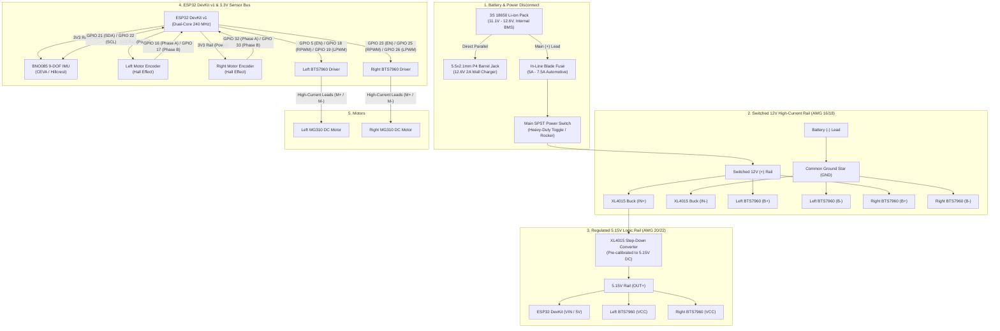

# Orca Robot — Phase 1 Electrical Wiring & Schematic Guide

This document is the authoritative hardware wiring specification and connection schematic for **Orca Phase 1 (Bench Integration & Low-Level Control)**.

---

## 1. System Schematic Topology



---

## 2. Power Management & Distribution Subsystem

### 2.1 Battery & Safety Circuitry

* **Power Source:** 3S2P 18650 Li-ion pack (11.1V nominal, 12.6V max charge) equipped with an internal BMS.
* **Charging Port:** Panel-mount 5.5 x 2.1 mm P4 female DC barrel jack wired in parallel directly with the battery terminals **before the main switch**. This allows safe charging using a 12.6V 2A CC/CV wall charger without needing to switch on the robot.
* **Overcurrent Protection:** An in-line blade fuse holder with a **5A to 7.5A** fuse positioned on the positive lead immediately adjacent to the battery connector (XT60).
* **Main Disconnect:** Heavy-duty SPST toggle or rocker switch rated for at least 10A DC.

### 2.2 XL4015 DC-DC Step-Down Converter

* **Input:** Switched 12V bus (11.1V – 12.6V).
* **Output:** Pre-calibrated to **5.15V DC** (powers the ESP32 `VIN` pin and BTS7960 optocoupler `VCC` rails).
* **Grounding:** Input ground (`IN-`) and output ground (`OUT-`) connect to the shared Common Ground Star.

> [!CAUTION]
> **Calibrate the Step-Down BEFORE Connecting the ESP32:**
> Power the XL4015 module from the 12V battery and measure its output terminals with a digital multimeter. Turn the multi-turn brass trimpot until the output reads **5.15V DC**. Do not connect the ESP32 until this voltage is verified.

---

## 3. Motor Drivers (Dual BTS7960 / IBT-2)

Each MG310 motor is driven by its own dedicated BTS7960 43A H-bridge board.

### 3.1 High-Current Screw Terminals

| Terminal | Connected To | Wire Specification |
| :--- | :--- | :--- |
| **`B+`** | Switched 12V Positive Rail | AWG 16 to 18 Silicone Wire |
| **`B-`** | Common Ground Star | AWG 16 to 18 Silicone Wire |
| **`M+`** | Motor Terminal (+) | AWG 18 Silicone Wire |
| **`M-`** | Motor Terminal (-) | AWG 18 Silicone Wire |

### 3.2 Logic Control Headers (8-Pin Headers)

#### Left Motor Driver (BTS7960 #1)

| BTS7960 Pin | Connected To | Signal Description |
| :--- | :--- | :--- |
| **`VCC`** | 5.15V Rail (XL4015 `OUT+`) | Powers optocouplers |
| **`GND`** | Common GND (ESP32 `GND`) | Logic ground reference |
| **`R_EN`** | **ESP32 GPIO 5** | Left Enable (Tied with `L_EN`) |
| **`L_EN`** | Tied to `R_EN` (**GPIO 5**) | Left Enable |
| **`RPWM`** | **ESP32 GPIO 18** | Forward PWM (20 kHz, 10-bit LEDC) |
| **`LPWM`** | **ESP32 GPIO 19** | Reverse PWM (20 kHz, 10-bit LEDC) |
| **`R_IS`** | *Not Connected (NC)* | Current alarm (unused) |
| **`L_IS`** | *Not Connected (NC)* | Current alarm (unused) |

#### Right Motor Driver (BTS7960 #2)

| BTS7960 Pin | Connected To | Signal Description |
| :--- | :--- | :--- |
| **`VCC`** | 5.15V Rail (XL4015 `OUT+`) | Powers optocouplers |
| **`GND`** | Common GND (ESP32 `GND`) | Logic ground reference |
| **`R_EN`** | **ESP32 GPIO 23** | Right Enable (Tied with `L_EN`) |
| **`L_EN`** | Tied to `R_EN` (**GPIO 23**) | Right Enable |
| **`RPWM`** | **ESP32 GPIO 25** | Forward PWM (20 kHz, 10-bit LEDC) |
| **`LPWM`** | **ESP32 GPIO 26** | Reverse PWM (20 kHz, 10-bit LEDC) |
| **`R_IS`** | *Not Connected (NC)* | Current alarm (unused) |
| **`L_IS`** | *Not Connected (NC)* | Current alarm (unused) |

---

## 4. MG310 DC Motors & Magnetic Quadrature Encoders

Standard MG310 motors feature a 6-wire connector:

```text
[Motor +] [Encoder GND] [Phase A] [Phase B] [Encoder VCC] [Motor -]
```

> [!IMPORTANT]
> **Power Encoders from ESP32 3.3V:**
> Always wire encoder `VCC` to the ESP32 **`3V3`** pin. Powering the Hall sensors from 3.3V ensures their output pulses are native 3.3V logic, completely safe for ESP32 GPIO inputs without requiring logic level converters.

### 4.1 Left Motor & Encoder

* **Motor Leads:**
  * Motor `(+)` $\to$ Left BTS7960 `M+`
  * Motor `(-)` $\to$ Left BTS7960 `M-`
* **Encoder Leads:**
  * Encoder `VCC` $\to$ ESP32 **`3V3`**
  * Encoder `GND` $\to$ Common **`GND`**
  * Encoder `Phase A` (C1) $\to$ **ESP32 GPIO 16** (PCNT Hardware Counter)
  * Encoder `Phase B` (C2) $\to$ **ESP32 GPIO 17** (PCNT Hardware Counter)

### 4.2 Right Motor & Encoder

* **Motor Leads:**
  * Motor `(+)` $\to$ Right BTS7960 `M+`
  * Motor `(-)` $\to$ Right BTS7960 `M-`
* **Encoder Leads:**
  * Encoder `VCC` $\to$ ESP32 **`3V3`**
  * Encoder `GND` $\to$ Common **`GND`**
  * Encoder `Phase A` (C1) $\to$ **ESP32 GPIO 32** (PCNT Hardware Counter)
  * Encoder `Phase B` (C2) $\to$ **ESP32 GPIO 33** (PCNT Hardware Counter)

---

## 5. BNO085 IMU Sensor Hub

The BNO085 communicates with the ESP32 over high-speed hardware I2C (400 kHz Fast-Mode).

| BNO085 Pin | Connected To | Description |
| :--- | :--- | :--- |
| **`VCC`** | ESP32 **`3V3`** | Native 3.3V logic supply |
| **`GND`** | Common **`GND`** | Ground reference |
| **`SDA`** | **ESP32 GPIO 21** | I2C Data line |
| **`SCL`** | **ESP32 GPIO 22** | I2C Clock line |
| **`INT`** | *Not Connected (NC)* | Optional interrupt (polled in Phase 1) |
| **`RST`** | *Not Connected (NC)* | Reset line (pulls up internally) |

---

## 6. Master ESP32 Pin Allocation Table (Phase 1)

| ESP32 Pin | Direction | Subsystem | Connected Device | Voltage Level |
| :--- | :--- | :--- | :--- | :--- |
| **`VIN` (5V)** | Power In | Power | XL4015 Buck `OUT+` | 5.15V DC |
| **`GND`** | Reference | Power | Common Ground Star | 0V |
| **`3V3`** | Power Out | Power | BNO085 IMU + Encoders | 3.3V DC (Max 500mA) |
| **`GPIO 5`** | Output | Left Drivetrain | Left BTS7960 `R_EN` / `L_EN` | 3.3V Logic |
| **`GPIO 18`**| Output (LEDC) | Left Drivetrain | Left BTS7960 `RPWM` (Forward) | 3.3V Logic (20 kHz) |
| **`GPIO 19`**| Output (LEDC) | Left Drivetrain | Left BTS7960 `LPWM` (Reverse) | 3.3V Logic (20 kHz) |
| **`GPIO 23`**| Output | Right Drivetrain| Right BTS7960 `R_EN` / `L_EN`| 3.3V Logic |
| **`GPIO 25`**| Output (LEDC) | Right Drivetrain| Right BTS7960 `RPWM` (Forward)| 3.3V Logic (20 kHz) |
| **`GPIO 26`**| Output (LEDC) | Right Drivetrain| Right BTS7960 `LPWM` (Reverse)| 3.3V Logic (20 kHz) |
| **`GPIO 16`**| Input (PCNT) | Odometry | Left Encoder Phase A | 3.3V Logic |
| **`GPIO 17`**| Input (PCNT) | Odometry | Left Encoder Phase B | 3.3V Logic |
| **`GPIO 32`**| Input (PCNT) | Odometry | Right Encoder Phase A | 3.3V Logic |
| **`GPIO 33`**| Input (PCNT) | Odometry | Right Encoder Phase B | 3.3V Logic |
| **`GPIO 21`**| Bidirectional| Perception | BNO085 IMU `SDA` | 3.3V I2C (400 kHz) |
| **`GPIO 22`**| Output | Perception | BNO085 IMU `SCL` | 3.3V I2C (400 kHz) |
| **`GPIO 34`**| *Unused / NC*| Telemetry | *Reserved for future Battery ADC*| *Skipped in Phase 1* |

> [!NOTE]
> **Strapping Pins Protected:** GPIO 0, 2, 12, and 15 are intentionally omitted from motor control and encoder feedback to avoid ESP32 boot-mode failures and flashing issues.

---

## 7. Wire Gauges & Standards

* **High-Current Bus (AWG 16 to AWG 18 Silicone Wire):**
  * Battery leads, XT60 connectors, fuse holder, power switch, BTS7960 `B+`/`B-` terminals, and `M+`/`M-` motor lines.
  * *Never use standard breadboard jumper wires on these paths due to fire and melting hazards under motor stall currents (up to 3.5A/motor).*
* **Signal & Logic Bus (AWG 24 to AWG 28 / Dupont Wire):**
  * ESP32 GPIO signals, BTS7960 control headers, encoder signals, and I2C lines.

---

## 8. Sequential Pre-Flight Checklist

1. **Verify No Short Circuits:**
   * With battery disconnected and switch closed (ON), measure resistance across the 12V positive rail and Common Ground using a multimeter. Ensure no continuity/short exists.
2. **Tune Buck Converter:**
   * Disconnect ESP32 `VIN`.
   * Connect battery, turn switch ON, and probe XL4015 `OUT+` and `OUT-`.
   * Adjust trimpot until the output reads **5.15V DC**.
   * Turn switch OFF.
3. **Power ESP32:**
   * Reconnect ESP32 `VIN` to 5.15V.
   * Turn switch ON. Verify ESP32 red power LED lights up and Bluetooth scanning begins.
4. **Driver Output Check (Without Motors):**
   * Connect multimeter or anti-parallel test LEDs across BTS7960 `M+` and `M-`.
   * Connect Xbox controller and test forward, reverse, and steering commands.
   * Verify expected voltage polarity and smooth slew-rate ramping.
5. **Connect Motors:**
   * Turn switch OFF, connect motor leads, place robot on a bench stand (wheels off the ground), and verify direction of rotation.
